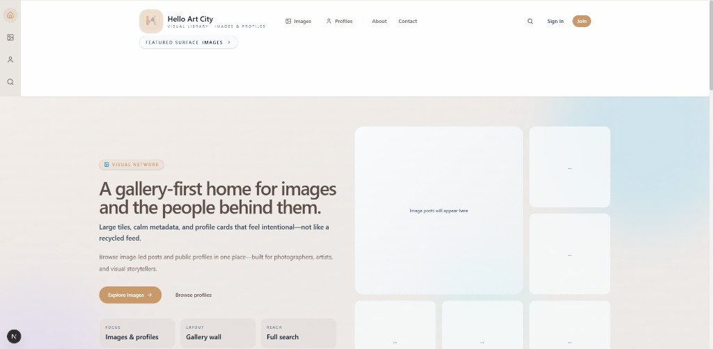
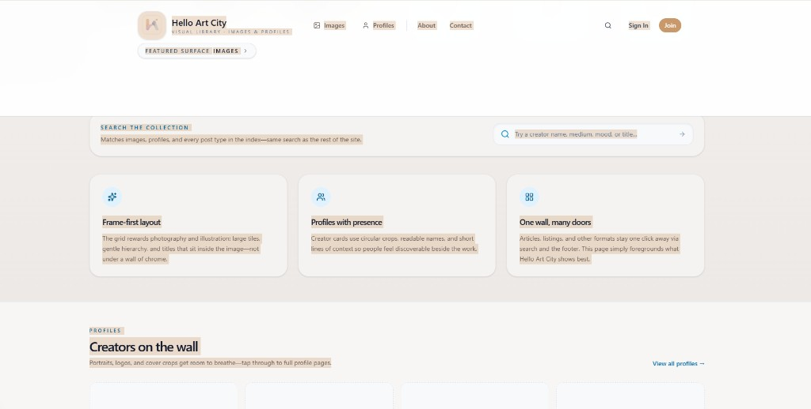
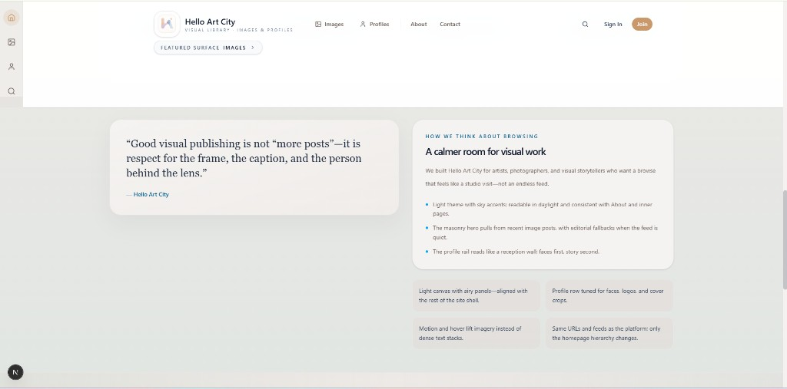
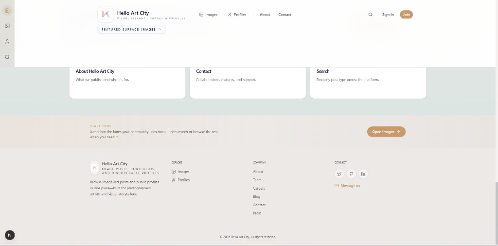
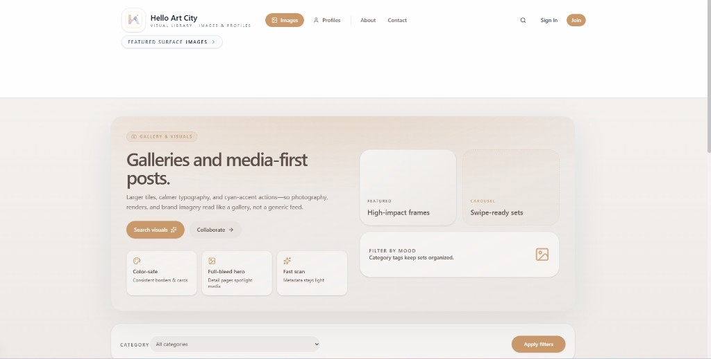
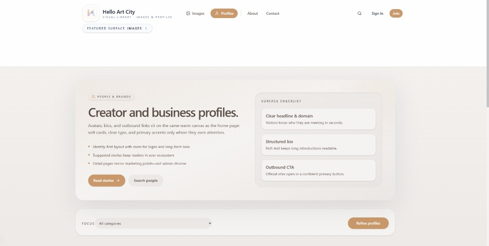
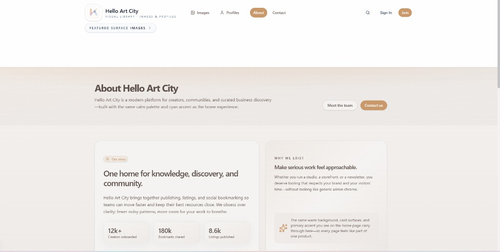
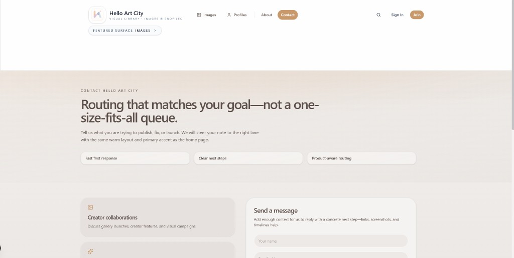

# Hello Art City

Image galleries and creator profiles on a calm, gallery-first surface. This repo is the Next.js app for [helloartcity.com](https://helloartcity.com).

## UI screenshots

Images below are stored in this repository under [`docs/readme/screenshots/`](./docs/readme/screenshots/) so they render on GitHub when you view this file on the default branch.

### Home — hero



### Home — search the collection



### Home — browsing & editorial cards



### Home — explore, start here, and footer



### Images (gallery surface)



### Profiles



### About



### Contact




## Development

```bash
pnpm install
pnpm dev
```

See project docs in `docs/` for setup and deployment notes where applicable.
